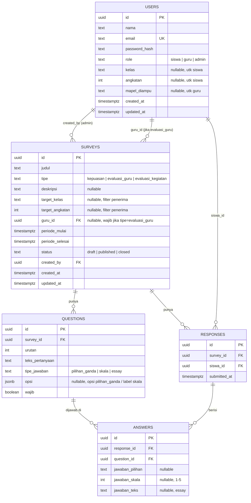

# Skema Database — Survey Siswa

PostgreSQL. Turunan dari entities di [PRD.md](../PRD.md) §9.

## ERD



## Aturan Bisnis Penting
- `responses` punya **unique constraint (survey_id, siswa_id)** — satu siswa hanya bisa submit sekali per survey (kecuali Admin reset).
- `surveys.guru_id` wajib diisi jika `tipe = evaluasi_guru`, sebaliknya harus `NULL` untuk tipe lain.
- Kolom jawaban di `answers` (`jawaban_pilihan` / `jawaban_skala` / `jawaban_teks`) hanya salah satu yang diisi sesuai `questions.tipe_jawaban` — divalidasi di application layer, bukan DB constraint, agar fleksibel.
- **Anonimitas evaluasi guru**: endpoint laporan untuk role Guru tidak boleh melakukan join yang mengekspos `responses.siswa_id`. Agregasi hanya ditampilkan jika jumlah responden ≥ N (misal 5), untuk mencegah identifikasi individu dari kelas kecil.

## DDL Referensi (PostgreSQL)

```sql
CREATE TYPE user_role AS ENUM ('siswa', 'guru', 'admin');
CREATE TYPE survey_type AS ENUM ('kepuasan', 'evaluasi_guru', 'evaluasi_kegiatan');
CREATE TYPE survey_status AS ENUM ('draft', 'published', 'closed');
CREATE TYPE question_type AS ENUM ('pilihan_ganda', 'skala', 'essay');

CREATE TABLE users (
    id UUID PRIMARY KEY DEFAULT gen_random_uuid(),
    nama TEXT NOT NULL,
    email TEXT UNIQUE NOT NULL,
    password_hash TEXT NOT NULL,
    role user_role NOT NULL,
    kelas TEXT,
    angkatan INT,
    mapel_diampu TEXT,
    created_at TIMESTAMPTZ NOT NULL DEFAULT now(),
    updated_at TIMESTAMPTZ NOT NULL DEFAULT now()
);

CREATE TABLE surveys (
    id UUID PRIMARY KEY DEFAULT gen_random_uuid(),
    judul TEXT NOT NULL,
    tipe survey_type NOT NULL,
    deskripsi TEXT,
    target_kelas TEXT,
    target_angkatan INT,
    guru_id UUID REFERENCES users(id),
    periode_mulai TIMESTAMPTZ NOT NULL,
    periode_selesai TIMESTAMPTZ NOT NULL,
    status survey_status NOT NULL DEFAULT 'draft',
    created_by UUID NOT NULL REFERENCES users(id),
    created_at TIMESTAMPTZ NOT NULL DEFAULT now(),
    updated_at TIMESTAMPTZ NOT NULL DEFAULT now()
);

CREATE TABLE questions (
    id UUID PRIMARY KEY DEFAULT gen_random_uuid(),
    survey_id UUID NOT NULL REFERENCES surveys(id) ON DELETE CASCADE,
    urutan INT NOT NULL,
    teks_pertanyaan TEXT NOT NULL,
    tipe_jawaban question_type NOT NULL,
    opsi JSONB,
    wajib BOOLEAN NOT NULL DEFAULT true
);

CREATE TABLE responses (
    id UUID PRIMARY KEY DEFAULT gen_random_uuid(),
    survey_id UUID NOT NULL REFERENCES surveys(id) ON DELETE CASCADE,
    siswa_id UUID NOT NULL REFERENCES users(id),
    submitted_at TIMESTAMPTZ NOT NULL DEFAULT now(),
    UNIQUE (survey_id, siswa_id)
);

CREATE TABLE answers (
    id UUID PRIMARY KEY DEFAULT gen_random_uuid(),
    response_id UUID NOT NULL REFERENCES responses(id) ON DELETE CASCADE,
    question_id UUID NOT NULL REFERENCES questions(id),
    jawaban_pilihan TEXT,
    jawaban_skala INT CHECK (jawaban_skala BETWEEN 1 AND 5),
    jawaban_teks TEXT
);

CREATE INDEX idx_questions_survey_id ON questions(survey_id);
CREATE INDEX idx_responses_survey_id ON responses(survey_id);
CREATE INDEX idx_answers_response_id ON answers(response_id);
CREATE INDEX idx_answers_question_id ON answers(question_id);
```
